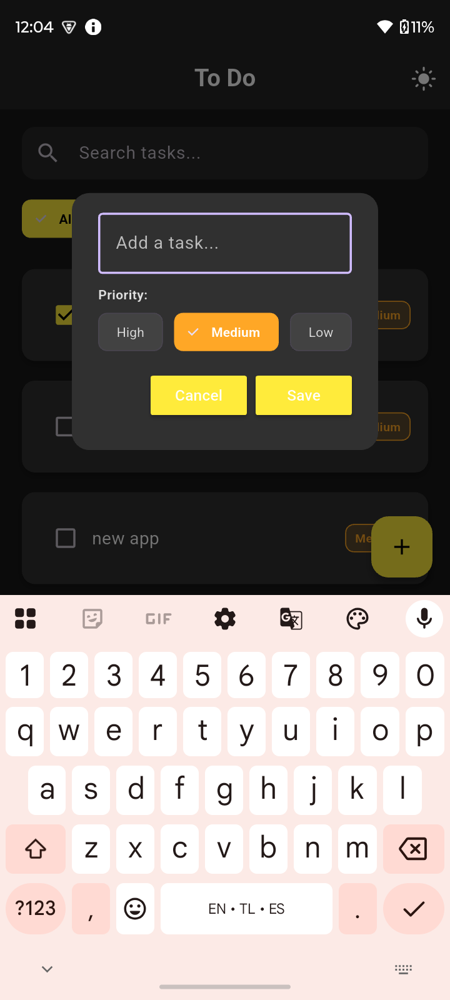
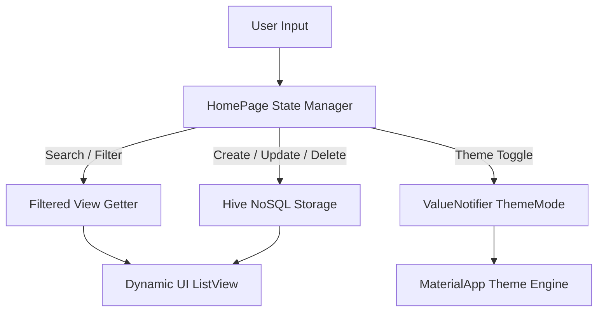

<div align="center">

  # 📝 Minimalist Flutter To-Do App
  
  **A production-ready, feature-rich task management mobile application built with Flutter & Hive.**

  [](https://flutter.dev/)
  [](https://dart.dev/)
  [](https://pub.dev/packages/hive_flutter)
  [](https://m3.material.io/)
  [](LICENSE)

  <p align="center">
    <a href="#-screenshots-gallery">Screenshots</a> •
    <a href="#-core-features">Features</a> •
    <a href="#-technical-deep-dive--what-why--how">Deep Dive & Bug Fixes</a> •
    <a href="#-architecture--data-flow">Architecture</a> •
    <a href="#-getting-started">Getting Started</a>
  </p>

</div>

---

## 📱 Screenshots Gallery

<div align="center">
  <table>
    <tr>
      <td align="center"><b>🌙 Dark Mode UI</b></td>
      <td align="center"><b>☀️ Light Mode UI</b></td>
      <td align="center"><b>➕ Priority Dialog</b></td>
      <td align="center"><b>🗑️ Swipe Gestures</b></td>
    </tr>
    <tr>
      <td></td>
      <td></td>
      <td></td>
      <td></td>
    </tr>
    <tr>
      <td align="center"><em>Sleek AMOLED dark theme</em></td>
      <td align="center"><em>Minimalist pastel yellow theme</em></td>
      <td align="center"><em>Priority choice chips (High/Med/Low)</em></td>
      <td align="center"><em>Directional swipe to edit & delete</em></td>
    </tr>
  </table>
</div>

---

## 📖 Project Overview

This Flutter application is a modern, responsive, and robust **To-Do Task Manager** developed to provide frictionless productivity. It combines offline-first local database persistence via **Hive NoSQL**, intuitive gesture controls via **Flutter Slidable**, and dynamic categorization with live search and multi-state theme switching.

---

## ✨ Core Features

- ⚡ **Offline-First Persistence**: High-speed, local NoSQL storage with Hive.
- 🌓 **Dynamic Theme Engine (Dark & Light Mode)**: Instant theme toggling saved locally in Hive.
- 🔍 **Real-Time Search Bar**: Instant query matching across task titles.
- 🏷️ **Category Filter Tabs with Live Counters**: Filter between `All (n)`, `Active (n)`, and `Completed (n)`.
- 🔴 **Priority Tags (High, Medium, Low)**: Visual urgency flags with customized color badges.
- ✏️ **Full Task Editing**: Modify task title and priority with pre-filled dialogs.
- ↩️ **Undo Delete SnackBar**: Accidental deletion recovery with index preservation.
- 👆 **Smooth Swipe Actions**: Edit and delete gestures powered by `flutter_slidable`.
- 🛡️ **Empty State Screen & Safe Input Validation**: Clean empty-state graphic when zero tasks match.

---

## 🔬 Technical Deep Dive — What, Why & How

This section documents the end-to-end engineering journey: **What issues existed, Why they occurred, How they were solved**, and **How new features were engineered**.

---

### 1. 🐞 Bug Fixes & Code Quality Hardening

#### A. Save & Cancel Callback Swap
* **Problem (Kya tha):** Save button dabane par dialog band ho raha tha aur Cancel button dabane par task add ho raha tha.
* **Root Cause (Kyu hua):** `HomePage` ke `createNewTask()` me `DialogBox` pass karte waqt `onSave` aur `onCancel` callbacks interchange ho gaye the.
* **Resolution (Kaise fix kiya):** Callbacks ko unke respective handlers se re-map kiya gaya aur save hone ke baad text controller ko reset (`_controller.clear()`) aur `Navigator.pop()` call kiya gaya.

#### B. Color Theming & Missing Yellow Accents (Material 3)
* **Problem (Kya tha):** Floating Action Button (FAB) aur Buttons yellow color me nahi render ho rahe the (default purple shade aa raha tha).
* **Root Cause (Kyu hua):** Flutter 3.16+ me Material 3 default hota hai, jisme legacy `primarySwatch: Colors.yellow` seed colors auto-generate nahi karta.
* **Resolution (Kaise fix kiya):** `main.dart` me `primaryColor: Colors.yellow`, `appBarTheme`, aur `floatingActionButtonTheme: FloatingActionButtonThemeData(backgroundColor: Colors.yellow, foregroundColor: Colors.black)` explicitly configure kiya gaya.

#### C. RenderFlex Text Overflow on Long Tasks
* **Problem (Kya tha):** Task ka naam lamba hone par right side par yellow-black stripe overflow error aata tha.
* **Root Cause (Kyu hua):** `Row` widget ke andar `Text` widget unbounded width consume kar raha tha.
* **Resolution (Kaise fix kiya):** `Text` widget ko `Expanded(child: Text(taskName))` me wrap kiya gaya taaki text dynamically next line par wrap ho sake.

#### D. Blank / Empty Task Creation
* **Problem (Kya tha):** Bina kuch type kiye Save dabane par khali task add ho jata tha.
* **Resolution (Kaise fix kiya):** Strict validation check add kiya gaya: `if (_controller.text.trim().isNotEmpty)`.

#### E. Immutability & Linter Warnings
* **Problem (Kya tha):** `StatelessWidget` ke andar mutable fields the (`must_be_immutable` warnings).
* **Resolution (Kaise fix kiya):** Saare widget fields ko `final` aur constructors ko `const` kiya gaya. `flutter analyze` run karke **0 issues** achieve kiye gaye.

---

### 2. 🚀 Feature Engineering Breakdown



#### ✏️ Feature 1: Task Editing Flow (`editTask`)
* **Objective:** User ko bina delete kiye existing tasks modify karne ki suvidha dena.
* **Implementation:** `TodoTile` me blue `SlidableAction(icon: Icons.edit)` add kiya gaya. Edit trigger hone par `_controller.text` me existing value pre-load hoti hai aur save hone par usi index ka item overwrite hokar Hive me sync ho jata hai.

#### ↩️ Feature 2: Undo Delete Recovery
* **Objective:** Galti se swipe hone par data loss prevent karna.
* **Implementation:** `deleteTask(index)` chalne par deleted task aur uska original index `(deletedIndex, deletedTask)` cache kar liya jata hai. Bottom par floating `SnackBar` show hota hai jisme `UNDO` button dabane par task wapas usi position par `insert(deletedIndex, deletedTask)` ho jata hai.

#### 🏷️ Feature 3: Multi-Tier Priority Tags (High, Medium, Low)
* **Objective:** Tasks ki urgency visually categorize karna.
* **Implementation:**
  - Dialog me 3 interactive `ChoiceChip` widgets (High 🔴, Medium 🟡, Low 🟢).
  - `TodoTile` par stylish dynamic border & background color badge.
  - **Backward Compatibility:** `database.dart` me data normalization lagaya gaya taaki purane tasks bina crash huye default `"Medium"` priority par fallback karein.

#### 🔍 Feature 4: Real-Time Search & Live Filter Chips
* **Objective:** Tasks find karne me speed aur category separation (All / Active / Completed).
* **Implementation:** `_filteredTasks` getter banaya gaya jo live search string aur selected filter tab dono ko filter karta hai. Safe index mapping (`MapEntry(originalIndex, task)`) use kiya gaya taaki filtered view me checkbox check karne par database ka actual index hi update ho.

#### 🌓 Feature 5: Persistent Dark Mode Engine
* **Objective:** Eye-comfort aur battery saving ke liye dark mode provide karna.
* **Implementation:** `main.dart` me `ValueNotifier<ThemeMode>` implement kiya gaya. User jab AppBar ka 🌙 / ☀️ icon dabata hai, theme dynamically switch hoti hai aur preference Hive storage me `'DARK_MODE'` key ke sath permanently save ho jati hai.

---

## 📂 Project Structure

```text
to_do_app/
├── android/                  # Android platform configurations
├── ios/                      # iOS platform configurations
├── lib/
│   ├── data/
│   │   └── database.dart     # Hive database CRUD operations, schema & theme persistence
│   ├── pages/
│   │   └── home_page.dart    # Main screen with search, filter tabs, theme toggle & task list
│   ├── util/
│   │   ├── dialog_box.dart   # Task input dialog with Priority ChoiceChips & validation
│   │   ├── my_button.dart    # Custom reusable primary-themed button
│   │   └── todo_tile.dart    # Task card with priority badges, checkbox & slidable gestures
│   └── main.dart             # App startup, Hive initialization, Theme engine (Light/Dark)
├── screenshots/              # High-resolution mobile application previews
├── pubspec.yaml              # Package dependencies & assets
└── README.md                 # Technical documentation & project guide
```

---

## 🛠️ Tech Stack & Packages

| Package | Version | Purpose |
| :--- | :--- | :--- |
| [**Flutter**](https://flutter.dev/) | `3.x` | Cross-platform UI Framework |
| [**Dart**](https://dart.dev/) | `3.x` | Strongly typed object-oriented language |
| [**hive**](https://pub.dev/packages/hive) | `^2.2.3` | Lightweight and fast NoSQL key-value database |
| [**hive_flutter**](https://pub.dev/packages/hive_flutter) | `^1.1.0` | Flutter extension utilities for Hive |
| [**flutter_slidable**](https://pub.dev/packages/flutter_slidable) | `^3.1.2` | Directional swipe actions (Edit & Delete) |

---

## 🚀 Getting Started

### Prerequisites
- [Flutter SDK](https://docs.flutter.dev/get-started/install) installed (v3.0.0+)
- Android Studio / VS Code with Flutter extension
- Connected Android/iOS device or emulator

### Installation & Run

1. **Clone the Repository:**
   ```bash
   git clone https://github.com/your-username/to_do_app.git
   cd to_do_app
   ```

2. **Install Dependencies:**
   ```bash
   flutter pub get
   ```

3. **Check Environment Health:**
   ```bash
   flutter doctor
   ```

4. **Launch Application:**
   ```bash
   flutter run
   ```

---

## 📄 License

This project is open source and available under the [MIT License](LICENSE).

<div align="center">
  <sub>Designed & Developed with ❤️ using Flutter</sub>
</div>
