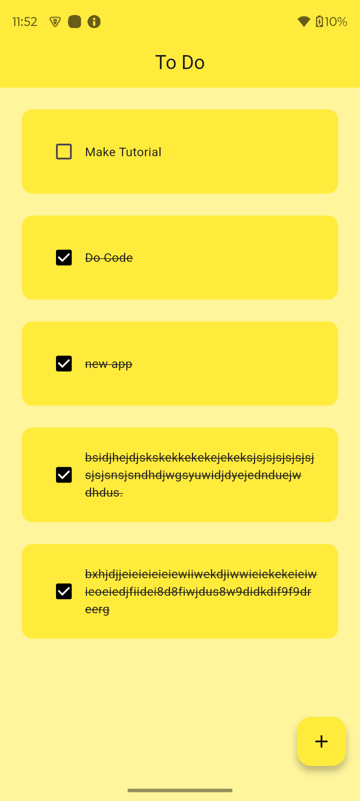
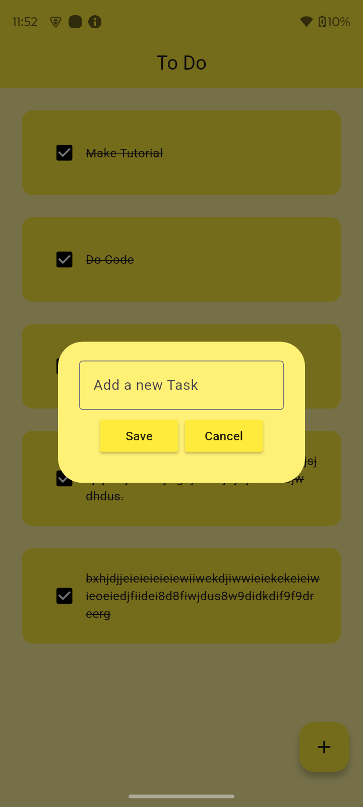
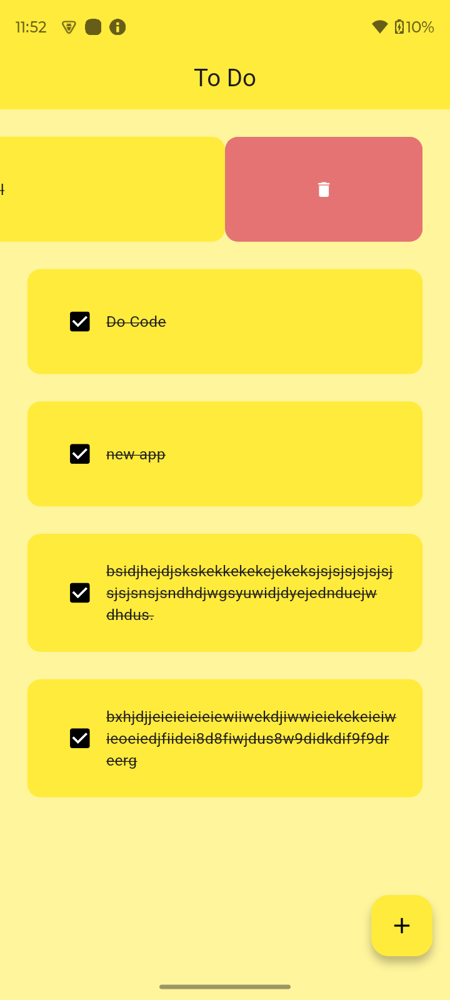

# 📝 Flutter To-Do App

A clean, minimal, and intuitive To-Do application built with **Flutter**, featuring local offline storage using **Hive** and smooth swipe-to-delete actions using **Flutter Slidable**.

---

## 📱 Screenshots

<p align="center">
  
  &nbsp;&nbsp;&nbsp;&nbsp;
  
  &nbsp;&nbsp;&nbsp;&nbsp;
  
</p>

<p align="center">
  <em>Home Screen &nbsp;&nbsp;&nbsp;&nbsp;&nbsp;&nbsp;&nbsp;&nbsp;&nbsp;&nbsp;&nbsp;&nbsp;&nbsp;&nbsp;&nbsp;&nbsp;&nbsp;&nbsp;&nbsp;&nbsp; Add Task Dialog &nbsp;&nbsp;&nbsp;&nbsp;&nbsp;&nbsp;&nbsp;&nbsp;&nbsp;&nbsp;&nbsp;&nbsp;&nbsp;&nbsp;&nbsp;&nbsp; Swipe to Delete</em>
</p>

---

## ✨ Features

- 💾 **Offline Storage (Hive)**: Fast, lightweight local database that automatically saves tasks so data persists across app restarts.
- 🗑️ **Swipe to Delete**: Intuitive swipe-left motion to delete tasks using `flutter_slidable`.
- ➕ **Add New Tasks**: Popup dialog box with custom yellow-themed buttons.
- ✅ **Task Completion**: Checkbox toggle with automatic strike-through styling.
- 🎨 **Minimal & Responsive UI**: Clean pastel yellow aesthetic tailored for Flutter Material design.

---

## 🛠️ Tech Stack & Packages

- **Framework:** [Flutter](https://flutter.dev/) (Dart)
- **Local Database:** [hive](https://pub.dev/packages/hive) & [hive_flutter](https://pub.dev/packages/hive_flutter)
- **UI & Gestures:** [flutter_slidable](https://pub.dev/packages/flutter_slidable)

---

## 🚀 Getting Started

### Prerequisites
Make sure you have Flutter installed on your machine.
- [Flutter Installation Guide](https://docs.flutter.dev/get-started/install)

### Installation

1. **Clone the repository:**
   ```bash
   git clone https://github.com/your-username/to_do_app.git
   ```

2. **Navigate into the project directory:**
   ```bash
   cd to_do_app
   ```

3. **Install dependencies:**
   ```bash
   flutter pub get
   ```

4. **Run the app:**
   ```bash
   flutter run
   ```
