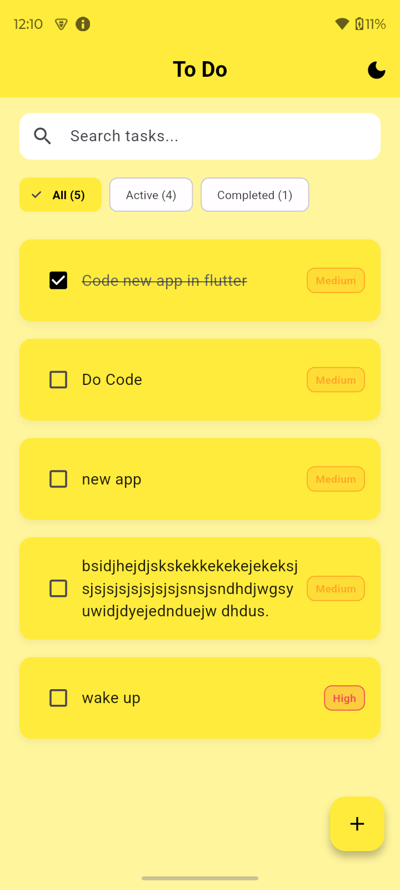
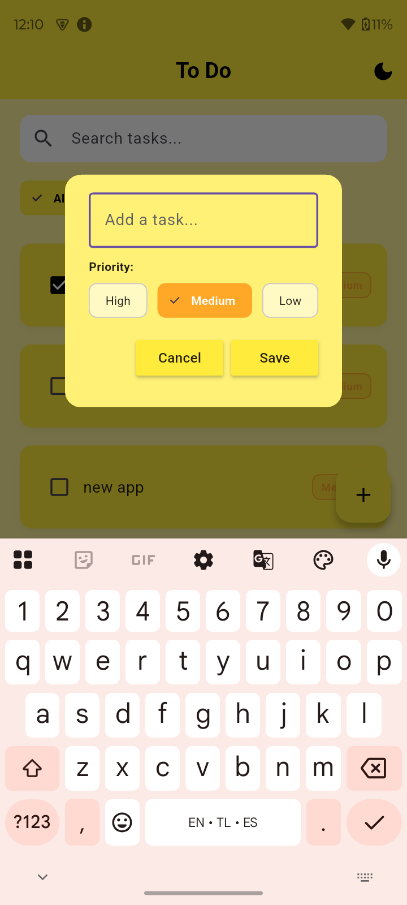
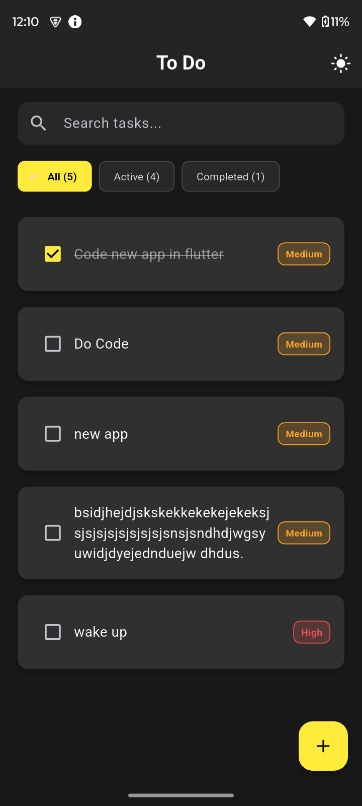
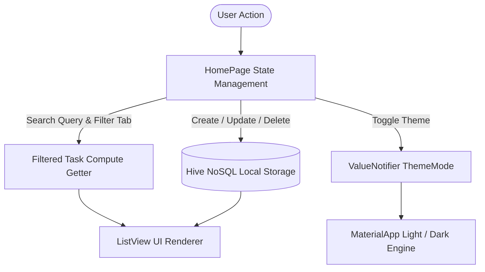

<div align="center">

  # 📝 Minimalist Flutter To-Do App
  
  **A production-ready, feature-rich task management mobile application built with Flutter & Hive.**

  [](https://flutter.dev/)
  [](https://dart.dev/)
  [](https://pub.dev/packages/hive_flutter)
  [](https://m3.material.io/)
  [](LICENSE)

  <p align="center">
    <a href="#-screenshots-showcase">Screenshots</a> •
    <a href="#-key-features">Key Features</a> •
    <a href="#-technical-deep-dive--what-why--how">Deep Dive & Architecture</a> •
    <a href="#-project-structure">Project Structure</a> •
    <a href="#-getting-started">Getting Started</a>
  </p>

</div>

---

## 📱 Screenshots Showcase

### ☀️ Light Theme Experience

<div align="center">
  <table>
    <tr>
      <td align="center"><b>🏠 Light Home Screen</b></td>
      <td align="center"><b>➕ Add / Edit Dialog</b></td>
      <td align="center"><b>🗑️ Swipe Gestures</b></td>
    </tr>
    <tr>
      <td></td>
      <td></td>
      <td></td>
    </tr>
    <tr>
      <td align="center"><em>Pastel yellow with search & filter chips</em></td>
      <td align="center"><em>Priority selection (High, Med, Low)</em></td>
      <td align="center"><em>Smooth gesture-driven deletion</em></td>
    </tr>
  </table>
</div>

---

### 🌙 Dark Theme Experience

<div align="center">
  <table>
    <tr>
      <td align="center"><b>🏠 Dark Home Screen</b></td>
      <td align="center"><b>➕ Dark Add / Edit Dialog</b></td>
      <td align="center"><b>⚡ Search & Filter State</b></td>
    </tr>
    <tr>
      <td></td>
      <td></td>
      <td></td>
    </tr>
    <tr>
      <td align="center"><em>High-contrast AMOLED dark theme</em></td>
      <td align="center"><em>Dark mode task creation with priority</em></td>
      <td align="center"><em>Dynamic category counter badges</em></td>
    </tr>
  </table>
</div>

---

## 📖 Project Overview

This application is a modern, responsive, and robust **To-Do Task Management Application** designed in **Flutter (Dart)**. It utilizes **Hive NoSQL** for instant offline-first persistence, incorporates **Material 3 dynamic theming (Light / Dark)**, and features gesture-driven list manipulation with **Flutter Slidable**.

---

## ✨ Key Features

- ⚡ **Offline-First Storage**: High-speed local NoSQL key-value database powered by [Hive](https://pub.dev/packages/hive_flutter).
- 🌓 **Dynamic Theme Engine (Dark & Light Mode)**: Instant theme toggling saved locally in Hive so the app remembers your preference on restart.
- 🔍 **Real-Time Live Search Bar**: Instant keyword filtering across task titles.
- 🏷️ **Category Filter Tabs with Counters**: Filter between `All (n)`, `Active (n)`, and `Completed (n)` with live count badges.
- 🔴 **Multi-Tier Priority Tags**: Visual urgency indicators (`High 🔴`, `Medium 🟡`, `Low 🟢`) with custom badge styling.
- ✏️ **Task Editing System**: Edit existing task names and priority levels seamlessly.
- ↩️ **Undo Delete Recovery**: Accidental deletion recovery via a floating SnackBar action with exact index preservation.
- 👆 **Smooth Swipe Actions**: Integrated `flutter_slidable` for swipe-to-delete and swipe-to-edit actions.
- 🛡️ **Safe Input Validation**: Prevents blank or whitespace-only task creation.

---

## 🔬 Technical Deep Dive — What, Why & How

This section provides an in-depth breakdown of the engineering challenges, root cause analysis, bug resolutions, and feature architectures implemented in this application.

---

### 1. 🐞 Issues Identified & Resolved

```
┌──────────────────────────────────────────────┬─────────────────────────────────────────────────┬──────────────────────────────────────────────────┐
│ Problem Statement (What was wrong)           │ Root Cause Analysis (Why it happened)           │ Technical Resolution (How it was solved)         │
├──────────────────────────────────────────────┼─────────────────────────────────────────────────┼──────────────────────────────────────────────────┤
│ 1. Inverted Save & Cancel Dialog Buttons     │ In `HomePage`, `onSave` & `onCancel` callbacks  │ Re-mapped handlers properly:                     │
│    (Save closed dialog, Cancel saved task)   │ were passed swapped to `DialogBox`.             │ `onSave: saveNewTask`, `onCancel: Navigator.pop`.│
├──────────────────────────────────────────────┼─────────────────────────────────────────────────┼──────────────────────────────────────────────────┤
│ 2. Missing Yellow Accents & FAB Styling      │ Flutter 3.16+ enforces Material 3 by default,   │ Explicitly defined `primaryColor: Colors.yellow` │
│    (Buttons rendered with default purple)    │ where legacy `primarySwatch` does not auto-seed.│ and `floatingActionButtonTheme` in `ThemeData`.  │
├──────────────────────────────────────────────┼─────────────────────────────────────────────────┼──────────────────────────────────────────────────┤
│ 3. `RenderFlex` Text Overflow on Long Tasks  │ `Text` widget inside `Row` had unbounded width, │ Wrapped `Text` inside `Expanded(child: Text(...))`│
│    (Yellow-black striped screen overflow)    │ overflowing horizontally on long strings.       │ enabling automatic multiline text wrapping.      │
├──────────────────────────────────────────────┼─────────────────────────────────────────────────┼──────────────────────────────────────────────────┤
│ 4. Blank / Empty Task Creation               │ `saveNewTask` added items without text check,   │ Added strict validation condition:               │
│    (Empty strings created phantom cards)     │ populating database with empty items.           │ `if (_controller.text.trim().isNotEmpty) { ... }`│
├──────────────────────────────────────────────┼─────────────────────────────────────────────────┼──────────────────────────────────────────────────┤
│ 5. Mutable Fields in Stateless Widgets       │ Instance fields were missing `final` keyword    │ Made all fields `final` and marked constructors  │
│    (`must_be_immutable` linter warnings)    │ causing Flutter analyzer warnings.              │ as `const` to achieve 0 compiler warnings.       │
└──────────────────────────────────────────────┴─────────────────────────────────────────────────┴──────────────────────────────────────────────────┘
```

---

### 2. 🚀 Feature Engineering & Architecture



#### ✏️ Feature 1: Task Editing Flow (`editTask`)
* **Why:** Users need to modify existing task titles and priorities without re-creating them.
* **How:** Triggered via swipe action or card tap. Loads the current task title into `_controller.text`, captures priority changes via `ChoiceChips`, updates the exact index in `db.toDoList`, and synchronizes state to Hive storage.

#### ↩️ Feature 2: Non-Destructive Undo Delete
* **Why:** Prevents accidental data loss when users swipe items.
* **How:** Upon delete, a snapshot tuple `(deletedIndex, deletedTask)` is cached in memory. A floating `SnackBar` is displayed with an `UNDO` action that re-inserts the task at its exact original position:
  ```dart
  db.toDoList.insert(deletedIndex, deletedTask);
  db.updateDataBase();
  ```

#### 🏷️ Feature 3: Multi-Tier Priority Tags (High, Medium, Low)
* **Why:** Allows users to visually distinguish between urgent and standard tasks.
* **How:** 
  - **Data Schema:** Enhanced schema to `[String title, bool isCompleted, String priority]`.
  - **Backward Compatibility:** Implemented database normalization on load (`loadData()`) so legacy 2-element lists automatically default to `"Medium"` without crashing.
  - **UI Badge:** Rendered with dynamic colored borders and tinted backgrounds matching each priority tier.

#### 🔍 Feature 4: Real-Time Search & Multi-Tab Filter System
* **Why:** Enables instant discovery and categorization (`All`, `Active`, `Completed`) in large task lists.
* **How:** Created a computed getter `_filteredTasks` that matches text queries against task names and applies active/completed status filters. Implemented safe index mapping (`MapEntry(originalIndex, task)`) ensuring that interactions on filtered items target the correct record in the underlying Hive database.

#### 🌓 Feature 5: Persistent Dark Mode Engine
* **Why:** Improves visual comfort in low-light environments and saves battery on OLED/AMOLED displays.
* **How:** Implemented a global `ValueNotifier<ThemeMode> themeNotifier` in `main.dart`. The theme selection is persisted in Hive under the `'DARK_MODE'` key, ensuring that the user's preferred theme is restored automatically on every app launch.

---

## 📂 Project Structure

```text
to_do_app/
├── android/                  # Android native configurations and build files
├── ios/                      # iOS native configurations and build files
├── lib/
│   ├── data/
│   │   └── database.dart     # Hive NoSQL database controller & schema normalization
│   ├── pages/
│   │   └── home_page.dart    # Primary screen (Search, Filter Tabs, Theme Toggle, ListView)
│   ├── util/
│   │   ├── dialog_box.dart   # Modal dialog with Priority ChoiceChips & validation
│   │   ├── my_button.dart    # Reusable primary-themed action button
│   │   └── todo_tile.dart    # Task card component with Slidable actions & priority badge
│   └── main.dart             # App entry point, Hive initialization, and Dynamic Theme engine
├── screenshots/              # High-resolution application screenshots
├── pubspec.yaml              # Dependency declarations and asset configuration
└── README.md                 # Project technical documentation
```

---

## 🛠️ Tech Stack & Dependencies

| Library | Version | Purpose |
| :--- | :--- | :--- |
| [**Flutter**](https://flutter.dev/) | `3.x` | Modern cross-platform UI toolkit |
| [**Dart**](https://dart.dev/) | `3.x` | Fast, object-oriented language for client apps |
| [**hive**](https://pub.dev/packages/hive) | `^2.2.3` | Lightweight and fast NoSQL key-value database |
| [**hive_flutter**](https://pub.dev/packages/hive_flutter) | `^1.1.0` | Flutter extension utilities for Hive |
| [**flutter_slidable**](https://pub.dev/packages/flutter_slidable) | `^3.1.2` | Gesture-driven directional swipe actions (Edit & Delete) |

---

## 🚀 Getting Started

### Prerequisites
- [Flutter SDK](https://docs.flutter.dev/get-started/install) installed (Version 3.0.0 or higher)
- Android Studio / VS Code with Flutter extensions
- Connected physical device or emulator/simulator

### Installation & Run

1. **Clone the Repository:**
   ```bash
   git clone https://github.com/your-username/to_do_app.git
   cd to_do_app
   ```

2. **Install Dependencies:**
   ```bash
   flutter pub get
   ```

3. **Verify Environment:**
   ```bash
   flutter doctor
   ```

4. **Run the Application:**
   ```bash
   flutter run
   ```

---

## 📄 License

This project is licensed under the [MIT License](LICENSE) - open for personal and educational use.

<div align="center">
  <sub>Built with ❤️ using Flutter & Hive</sub>
</div>
